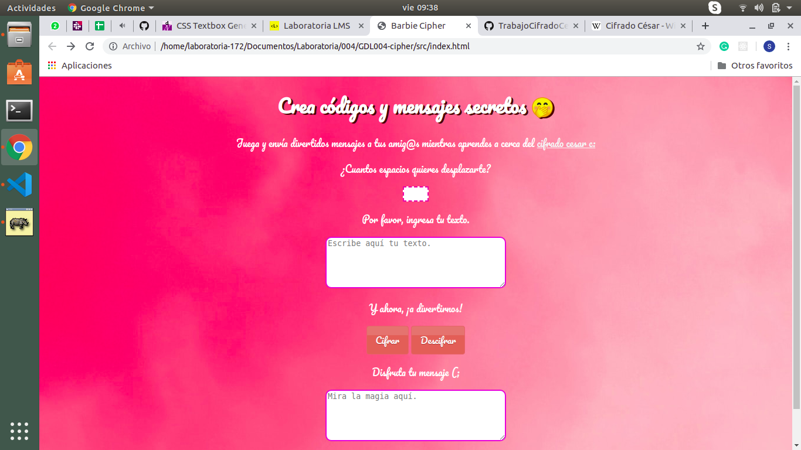
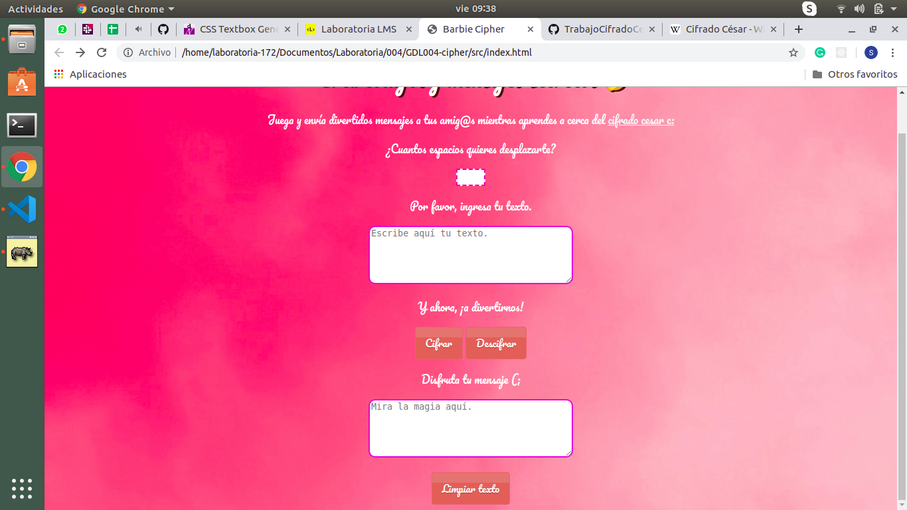
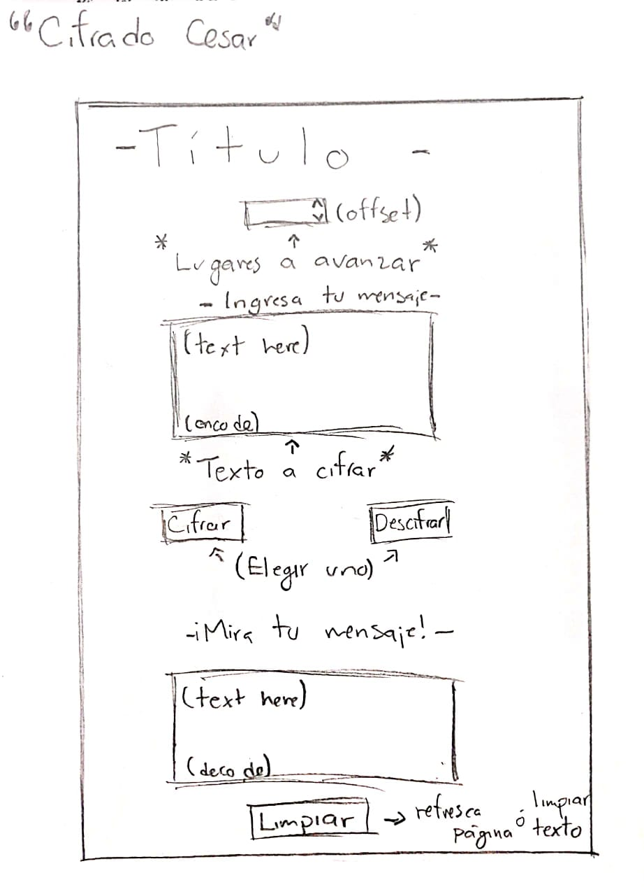
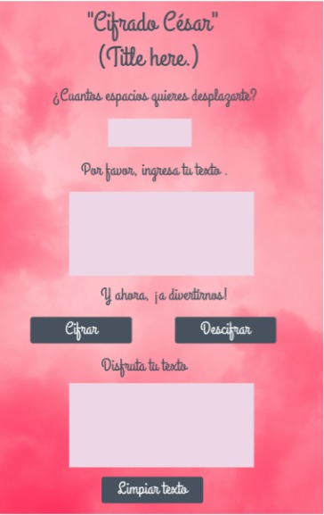

# Barbie Cipher

***
* *Barbie Cipher está enfocado a las niñas que tienen ese interés por aprender mientras juegan.*

* El resultado final es este: 

* El proyecto está enfocado principalmente en las niñas/adolescentes, para alimentar su curiosidad y enseñarles que aprender cosas nuevas puede ser muy divertido, está elaborado de una manera que sea fácil de entender y de usar, agregué el link directo a la página de wikipedia del Cifrado César para que las usuarias puedan informarse más a cerca del tema.
Me pareció buena idea hacerlo todo en una misma pantalla para que fuera más sencillo y rápido de utilizar.

 

* Alinear el contenido para que se vea más estético.
* Instrucciones
* Imágenes

